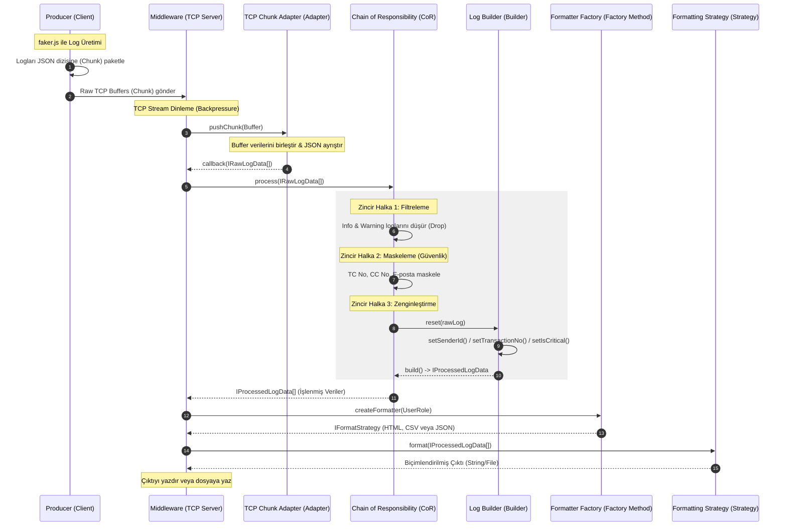

# CENG302 Data Middleware Projesi Mimari Tasarım Belgesi

Bu döküman, CENG302 - Data Middleware projesinin dizin yapısını, veri akışını ve `rules.md` anayasasında belirtilen zorunlu 5 tasarım şablonunun (Design Patterns) nasıl uygulanacağını açıklamaktadır.

---

## 📁 1. Proje Dizin Yapısı (Project Directory Layout)

Sistemimiz modüler bir TypeScript yapısı üzerine kurulmuştur:

```
yazilimmuhproje/
├── docs/                             # Kurallar, kılavuzlar ve ajan günlükleri
│   ├── rules.md                      # Proje anayasası
│   ├── project_details.md            # Ödev detayları ve isterler
│   ├── 01_orchestrator_agent.md      # Baş Mimar rol tanımı
│   ├── 02_producer_agent.md          # Veri Üretici rol tanımı
│   ├── 03_middleware_agent.md        # Ara Katman rol tanımı
│   ├── 04_validator_agent.md         # Doğrulayıcı rol tanımı
│   └── agent_logs/                   # Ajanların çalışma logları (Zorunlu)
│       ├── 01_log_orchestrator.md
│       ├── 02_log_producer.md
│       ├── 03_log_middleware.md
│       └── 04_log_validator.md
├── shared/                           # Ortak tipler ve arayüzler (Modüller arası bağımlılığı önler)
│   ├── types.ts                      # LogLevel, UserRole, veri yapıları (IRawLogData, vb.)
│   └── interfaces.ts                 # 5 Tasarım Kalıbının arayüz tanımları
├── producer/                         # Veri Üretici Modülü (Docker Servis 1)
│   ├── src/
│   │   ├── client.ts                 # TCP Soket bağlantı yönetimi
│   │   ├── generator.ts              # faker.js tabanlı log üreticisi
│   │   └── index.ts                  # Producer giriş noktası (Entry point)
│   ├── package.json
│   ├── tsconfig.json
│   └── Dockerfile
├── middleware/                       # Ara Katman Yazılım Modülü (Docker Servis 2)
│   ├── src/
│   │   ├── server.ts                 # TCP Soket sunucusu
│   │   ├── adapter/                  # TCP Chunk -> Log nesnesi adaptörü (Adapter Pattern)
│   │   │   └── chunkAdapter.ts
│   │   ├── pipeline/                 # Chain of Responsibility işlemcileri
│   │   │   ├── logProcessor.ts       # CoR temel sınıfı
│   │   │   ├── filterProcessor.ts    # Filtreleme (Info/Warn eleme)
│   │   │   ├── maskProcessor.ts      # Maskeleme (TC, CC, Email karartma)
│   │   │   └── enrichProcessor.ts    # Zenginleştirme (Builder çağrımı)
│   │   ├── builder/                  # Log nesnesi inşa edici (Builder Pattern)
│   │   │   └── logBuilder.ts
│   │   ├── strategy/                 # Çıktı formatlama stratejileri (Strategy Pattern)
│   │   │   ├── formatStrategy.ts     # Temel strateji arayüzü adaptasyonu
│   │   │   ├── htmlStrategy.ts       # HTML çıktı biçimlendirici
│   │   │   ├── csvStrategy.ts        # CSV çıktı biçimlendirici
│   │   │   └── jsonStrategy.ts       # JSON çıktı biçimlendirici
│   │   ├── factory/                  # Formatlayıcı seçici fabrika (Factory Method Pattern)
│   │   │   └── formatterFactory.ts
│   │   └── index.ts                  # Middleware giriş noktası (Entry point)
│   ├── package.json
│   ├── tsconfig.json
│   └── Dockerfile
├── docker-compose.yml                # Çoklu konteyner yapılandırması
├── STATE.md                          # Proje sprint ve görev takibi
└── README.md                         # Genel çalıştırma kılavuzu
```

---

## 🔄 2. Genel Mimari Veri Akış Şeması (Architecture & Data Flow)

Sistemimizdeki veri akışı tamamen asenkron TCP Soket iletişimi ve modüler bir veri işleme boru hattı (pipeline) üzerine kuruludur.



---

## 🛠️ 3. Tasarım Desenlerinin (Design Patterns) Uygulanması

Proje anayasası olan `rules.md` gereğince sistemimizde aşağıdaki 5 tasarım şablonu zorunlu olarak uygulanmaktadır:

### 1. Adapter Pattern (Yapısal)
* **Sınıf:** `TCPChunkAdapter` (İmplementasyon: `ITCPChunkAdapter`)
* **Amaç:** TCP soketinden gelen parçalı (chunk) veri akışları doğrudan JSON nesnesi olarak okunamaz (çünkü paketler birleşebilir veya bölünebilir). Bu sınıf, ham TCP Buffer paketlerini biriktirir, çerçeveler (delimiting veya chunk sınırlarını belirler) ve bunları geçerli `IRawLogData[]` nesne dizilerine dönüştürür.

### 2. Chain of Responsibility Pattern (Davranışsal)
* **Sınıflar:** `FilterProcessor` -> `MaskProcessor` -> `EnrichProcessor` (İmplementasyon: `ILogProcessor`)
* **Amaç:** Gelen ham log verilerini sırayla işlemek.
  * **Filtreleme:** `INFO` ve `WARNING` seviyesindeki loglar zincirin ilk adımında atılır (böylece bellek tüketimi önlenir).
  * **Maskeleme:** Hassas veriler (kredi kartı, TC kimlik, e-posta) regex desenleriyle maskelenir.
  * **Zenginleştirme:** Gerekli meta veri alanları eklenmesi için Builder adımına yönlendirilir.

### 3. Builder Pattern (Yaratımsal)
* **Sınıf:** `LogBuilder` (İmplementasyon: `ILogBuilder`)
* **Amaç:** Log nesnesinin zenginleştirilmesi (enrichment) esnasında karmaşık log alanlarını (`senderId`, `transactionNo`, `isCritical`) adım adım ve güvenli bir şekilde inşa etmek.

### 4. Strategy Pattern (Davranışsal)
* **Sınıflar:** `HtmlStrategy`, `CsvStrategy`, `JsonStrategy` (İmplementasyon: `IFormatStrategy`)
* **Amaç:** Sistemdeki farklı rollere (System Admin, Cybersec, Web Dev) göre çıktı biçimlendirme algoritmasını modüler hale getirmek. Sunucu kodu biçimlendirmenin detaylarını bilmez, sadece stratejiyi çağırır.

### 5. Factory Method Pattern (Yaratımsal)
* **Sınıf:** `FormatterFactory` (İmplementasyon: `IFormatterFactory`)
* **Amaç:** Gelen kullanıcı isteğinin rolüne (UserRole) göre hangi biçimlendiricinin (Strategy) kullanılacağını seçme sorumluluğunu tek bir noktada toplamak. Sunucu doğrudan somut strateji sınıflarına bağımlı olmaz (Loose Coupling).

---

## 🐳 4. Docker Altyapısı ve İletişim

* Proje, `docker-compose.yml` ile ayağa kaldırılır.
* **TCP İletişimi:** `middleware` konteyneri `3000` portunda bir TCP Server başlatır. `producer` konteyneri `middleware:3000` adresine TCP Client olarak bağlanır.
* **Backpressure Önlemi:** Eğer `producer` veri üretim hızını çok artırırsa ve `middleware` kuyruğu şişerse, TCP soketinin `pause()` ve `resume()` özellikleri kullanılarak veri akışı dengelenir.
