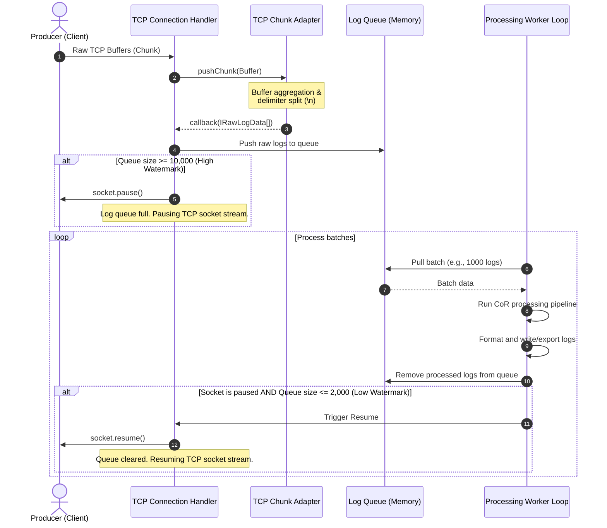
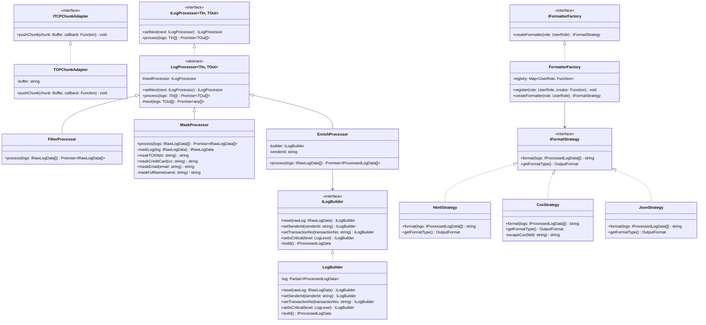

# CENG302 Data Middleware - Architectural Design Document

This design document outlines the technical architecture, data processing pipeline, and design patterns utilized in the Middleware component of the CENG302 Data Middleware system. 

---

## 📁 1. Module File Structure

To align with the directory layout outlined in the system architecture, the files in the `middleware` module are structured as follows:

```text
middleware/
├── src/
│   ├── index.ts                  # Application Entry Point
│   ├── server.ts                 # TCP Socket Server & Connection Manager
│   ├── adapter/
│   │   └── chunkAdapter.ts       # TCP Chunk to JSON Adapter (Adapter Pattern)
│   ├── pipeline/
│   │   ├── logProcessor.ts       # Abstract Base Chain Processor (CoR Pattern)
│   │   ├── filterProcessor.ts    # Info/Warning Log Dropper (CoR - Halkası 1)
│   │   ├── maskProcessor.ts      # Sensitive Info Anonymizer (CoR - Halkası 2)
│   │   └── enrichProcessor.ts    # Metadata Enrichment & Builder Invoker (CoR - Halkası 3)
│   ├── builder/
│   │   └── logBuilder.ts         # Step-by-Step Log Assembler (Builder Pattern)
│   ├── strategy/
│   │   ├── htmlStrategy.ts       # HTML Output Formatting (Strategy Pattern)
│   │   ├── csvStrategy.ts        # CSV Output Formatting (Strategy Pattern)
│   │   └── jsonStrategy.ts       # JSON Output Formatting (Strategy Pattern)
│   └── factory/
│       └── formatterFactory.ts   # Registry-based OCP Formatter Factory (Factory Method)
├── package.json
├── tsconfig.json
└── Dockerfile
```

---

## ⚡ 2. TCP Server Socket Architecture & Backpressure Mechanism

### Connection & Stream Management
The Middleware operates an asynchronous TCP socket server (built on Node.js `net.Server`) listening on port `3000`. 
Each client connection is assigned a connection-specific handler, which encapsulates the socket stream, an instance of `TCPChunkAdapter`, and a dedicated log queue.

### The Deadlock Risk in Naive Socket Pausing
A naive backpressure approach would pause the socket directly on the socket's `data` event (e.g., calling `socket.pause()` upon receiving a buffer, processing the payload, and calling `socket.resume()` when finished).
* **Deadlock Trigger:** Because TCP stream transmission is arbitrary, a chunk may end in the middle of a JSON object (a partial frame). The `TCPChunkAdapter` must wait for subsequent chunk(s) to complete and parse the frame. If the socket is paused while holding a partial frame, the system will wait indefinitely for the rest of the frame, but no data can be read because the socket is paused. This is a fatal deadlock.

### Solution: Watermark Queue-Based Backpressure
To prevent deadlocks, the TCP socket is never paused during raw buffer reception. The socket is only paused when the **queue of fully-parsed, ready-to-process logs** exceeds the system capacity thresholds.

* **High Watermark:** `10,000` logs. If the queue length equals or exceeds 10,000, `socket.pause()` is called to pause reading from the TCP socket buffer.
* **Low Watermark:** `2,000` logs. When the execution worker processes logs in batches and reduces the queue length to 2,000 or fewer, `socket.resume()` is called.



### Class Schema for TCP Socket Server & Connection Handler
```typescript
import * as net from 'net';
import { ITCPChunkAdapter, ILogProcessor } from '../shared/interfaces';
import { IRawLogData, IProcessedLogData } from '../shared/types';

export class LogTCPServer {
  private server: net.Server;
  private port: number;
  private pipeline: ILogProcessor<IRawLogData, IProcessedLogData>;

  constructor(port: number, pipeline: ILogProcessor<IRawLogData, IProcessedLogData>) {
    this.port = port;
    this.pipeline = pipeline;
    this.server = net.createServer((socket) => this.handleConnection(socket));
  }

  public start(): void {
    this.server.listen(this.port, () => {
      console.log(`[Middleware] TCP Server running on port \${this.port}`);
    });
  }

  private handleConnection(socket: net.Socket): void {
    const handler = new TCPConnectionHandler(socket, this.pipeline);
    handler.initialize();
  }
}

export class TCPConnectionHandler {
  private socket: net.Socket;
  private adapter: ITCPChunkAdapter;
  private pipeline: ILogProcessor<IRawLogData, IProcessedLogData>;
  private queue: IRawLogData[] = [];
  private isPaused: boolean = false;
  private isWorking: boolean = false;

  private readonly HIGH_WATERMARK = 10000;
  private readonly LOW_WATERMARK = 2000;
  private readonly BATCH_SIZE = 1000;

  constructor(socket: net.Socket, pipeline: ILogProcessor<IRawLogData, IProcessedLogData>) {
    this.socket = socket;
    this.pipeline = pipeline;
    this.adapter = new TCPChunkAdapter();
  }

  public initialize(): void {
    const clientId = `\${this.socket.remoteAddress}:\${this.socket.remotePort}`;
    console.log(`[Middleware] Client connected: \${clientId}`);

    this.socket.on('data', (chunk: Buffer) => {
      this.adapter.pushChunk(chunk, (parsedLogs) => {
        this.enqueue(parsedLogs);
      });
    });

    this.socket.on('close', () => {
      console.log(`[Middleware] Client disconnected: \${clientId}`);
      this.flushRemaining();
    });

    this.socket.on('error', (err) => {
      console.error(`[Middleware] Socket error on client \${clientId}:`, err.message);
    });
  }

  private enqueue(logs: IRawLogData[]): void {
    this.queue.push(...logs);
    
    if (this.queue.length >= this.HIGH_WATERMARK && !this.isPaused) {
      this.socket.pause();
      this.isPaused = true;
      console.warn(`[Backpressure] Queue size \${this.queue.length} >= \${this.HIGH_WATERMARK}. Socket paused.`);
    }

    this.triggerWorker();
  }

  private async triggerWorker(): Promise<void> {
    if (this.isWorking) return;
    this.isWorking = true;

    try {
      while (this.queue.length > 0) {
        const batch = this.queue.slice(0, this.BATCH_SIZE);
        const processedBatch = await this.pipeline.process(batch);
        this.exportProcessedLogs(processedBatch);
        this.queue.splice(0, batch.length);

        if (this.isPaused && this.queue.length <= this.LOW_WATERMARK) {
          this.socket.resume();
          this.isPaused = false;
          console.log(`[Backpressure] Queue size \${this.queue.length} <= \${this.LOW_WATERMARK}. Socket resumed.`);
        }
      }
    } catch (error) {
      console.error('[Middleware] Queue worker loop encountered error:', error);
    } finally {
      this.isWorking = false;
    }
  }

  private exportProcessedLogs(logs: IProcessedLogData[]): void {
    // Write logs to appropriate destinations / files depending on current configuration
  }

  private flushRemaining(): void {
    if (this.queue.length > 0) {
      this.triggerWorker();
    }
  }
}
```

---

## 🛠️ 3. TCP Chunk Adapter Pattern Design

### Purpose & Algorithm
`TCPChunkAdapter` implements the `ITCPChunkAdapter` interface. It resolves TCP streaming packet issues (chunks split/merged during transmission) by aggregating incoming byte buffers, looking for standard newline (`\n`) delimiters, extracting complete JSON messages, and leaving partial JSON strings in the buffer for subsequent chunks.

```typescript
import { ITCPChunkAdapter } from '../../shared/interfaces';
import { IRawLogData } from '../../shared/types';

export class TCPChunkAdapter implements ITCPChunkAdapter {
  private buffer: string = '';

  public pushChunk(chunk: Buffer, callback: (logs: IRawLogData[]) => void): void {
    this.buffer += chunk.toString('utf-8');

    const parts = this.buffer.split('\n');
    this.buffer = parts.pop() || '';

    const logs: IRawLogData[] = [];
    for (const part of parts) {
      const trimmed = part.trim();
      if (trimmed === '') continue;

      try {
        const rawLog: IRawLogData = JSON.parse(trimmed);
        logs.push(rawLog);
      } catch (err: any) {
        console.error(`[TCPChunkAdapter] Failed to parse JSON frame: \${trimmed}. Error: \${err.message}`);
      }
    }

    if (logs.length > 0) {
      callback(logs);
    }
  }
}
```

---

## 🔗 4. Chain of Responsibility (CoR) Pipeline Design

The processing pipeline is implemented via the Chain of Responsibility design pattern. 

### Chain Sequence:
1. **FilterProcessor:** Discards all `INFO` and `WARNING` logs early in the pipeline to optimize memory allocation and throughput.
2. **MaskProcessor:** Anonymizes Personally Identifiable Information (PII) including TC No, Credit Card, and Email using robust, non-backtracking regular expressions.
3. **EnrichProcessor:** Zenginleştirir (enriches) the logs by calling the `LogBuilder` to generate unique transaction IDs, sender IDs, and critical markers.

```mermaid
graph LR
    RawLogs[IRawLogData[]] --> Filter[FilterProcessor]
    Filter -->|Only ERROR / CRITICAL| Mask[MaskProcessor]
    Filter -->|INFO / WARNING| Drop((Dropped))
    Mask -->|Anonymized Logs| Enrich[EnrichProcessor]
    Enrich -->|LogBuilder Step-by-Step| Processed[IProcessedLogData[]]
```

### Type-Safe Abstract Base Class
Rather than using `any[]` which degrades compilation type benefits, our pipeline utilizes TypeScript generics.
```typescript
import { ILogProcessor } from '../../shared/interfaces';

export abstract class LogProcessor<TIn, TOut> implements ILogProcessor<TIn, TOut> {
  protected nextProcessor?: ILogProcessor<TOut, any>;

  public setNext<TNextOut>(next: ILogProcessor<TOut, TNextOut>): ILogProcessor<TOut, TNextOut> {
    this.nextProcessor = next;
    return next;
  }

  public abstract process(logs: TIn[]): Promise<TOut[]>;

  protected async next(logs: TOut[]): Promise<any[]> {
    if (this.nextProcessor) {
      return this.nextProcessor.process(logs);
    }
    return logs;
  }
}
```

### Concrete Processors

#### 1. FilterProcessor (Early Discard / Memory Optimization)
```typescript
import { LogProcessor } from './logProcessor';
import { IRawLogData, LogLevel } from '../../shared/types';

export class FilterProcessor extends LogProcessor<IRawLogData, IRawLogData> {
  public async process(logs: IRawLogData[]): Promise<IRawLogData[]> {
    const filtered = logs.filter(
      (log) => log.level !== LogLevel.INFO && log.level !== LogLevel.WARNING
    );

    const droppedCount = logs.length - filtered.length;
    if (droppedCount > 0) {
      console.log(`[FilterProcessor] Dropped \${droppedCount} logs (INFO/WARNING).`);
    }

    return this.next(filtered);
  }
}
```

#### 2. MaskProcessor (PII Anonymization)
```typescript
import { LogProcessor } from './logProcessor';
import { IRawLogData } from '../../shared/types';

export class MaskProcessor extends LogProcessor<IRawLogData, IRawLogData> {
  public async process(logs: IRawLogData[]): Promise<IRawLogData[]> {
    const masked = logs.map((log) => this.maskLog(log));
    return this.next(masked);
  }

  private maskLog(log: IRawLogData): IRawLogData {
    return {
      ...log,
      fullName: this.maskFullName(log.fullName),
      tcNo: this.maskTCKN(log.tcNo),
      creditCard: this.maskCreditCard(log.creditCard),
      email: this.maskEmail(log.email),
    };
  }

  public maskTCKN(tc: string): string {
    const trimmed = tc.trim();
    if (!/^\d{11}$/.test(trimmed)) return tc;
    return '*********' + trimmed.slice(9);
  }

  public maskCreditCard(cc: string): string {
    const digitsOnly = cc.replace(/\D/g, '');
    if (digitsOnly.length < 13 || digitsOnly.length > 19) return cc;

    let digitCounter = 0;
    const maskLimit = digitsOnly.length - 4;

    return cc
      .split('')
      .map((char) => {
        if (/\d/.test(char)) {
          if (digitCounter < maskLimit) {
            digitCounter++;
            return '*';
          }
        }
        return char;
      })
      .join('');
  }

  public maskEmail(email: string): string {
    const parts = email.trim().split('@');
    if (parts.length !== 2) return email;
    
    const [local, domain] = parts;
    if (local.length <= 1) {
      return `*@\${domain}`;
    }
    
    return `\${local[0]}\${'*'.repeat(local.length - 1)}@\${domain}`;
  }

  private maskFullName(name: string): string {
    return name
      .split(' ')
      .map((part) => {
        if (part.length <= 1) return '*';
        return part[0] + '*'.repeat(part.length - 1);
      })
      .join(' ');
  }
}
```

#### 3. EnrichProcessor (Builder Integration)
```typescript
import { LogProcessor } from './logProcessor';
import { IRawLogData, IProcessedLogData } from '../../shared/types';
import { ILogBuilder } from '../../shared/interfaces';
import * as crypto from 'crypto';

export class EnrichProcessor extends LogProcessor<IRawLogData, IProcessedLogData> {
  private builder: ILogBuilder;
  private senderId: string;

  constructor(builder: ILogBuilder, senderId: string) {
    super();
    this.builder = builder;
    this.senderId = senderId;
  }

  public async process(logs: IRawLogData[]): Promise<IProcessedLogData[]> {
    const enriched = logs.map((log) => {
      const transactionNo = crypto.randomUUID();

      return this.builder
        .reset(log)
        .setSenderId(this.senderId)
        .setTransactionNo(transactionNo)
        .setIsCritical(log.level)
        .build();
    });

    return this.next(enriched);
  }
}
```

---

## 🏗️ 5. LogBuilder Design (Builder Pattern)

The `LogBuilder` implements `ILogBuilder` to construct `IProcessedLogData` objects methodically.

```typescript
import { ILogBuilder } from '../../shared/interfaces';
import { IRawLogData, IProcessedLogData, LogLevel } from '../../shared/types';

export class LogBuilder implements ILogBuilder {
  private log!: Partial<IProcessedLogData>;

  public reset(rawLog: IRawLogData): ILogBuilder {
    this.log = {
      timestamp: rawLog.timestamp,
      level: rawLog.level,
      fullName: rawLog.fullName,
      tcNo: rawLog.tcNo,
      creditCard: rawLog.creditCard,
      email: rawLog.email,
      message: rawLog.message,
      details: rawLog.details,
    };
    return this;
  }

  public setSenderId(senderId: string): ILogBuilder {
    this.log.senderId = senderId;
    return this;
  }

  public setTransactionNo(transactionNo: string): ILogBuilder {
    this.log.transactionNo = transactionNo;
    return this;
  }

  public setIsCritical(level: LogLevel): ILogBuilder {
    this.log.isCritical = level === LogLevel.CRITICAL || level === LogLevel.ERROR;
    return this;
  }

  public build(): IProcessedLogData {
    if (
      !this.log.timestamp ||
      !this.log.level ||
      !this.log.fullName ||
      !this.log.tcNo ||
      !this.log.creditCard ||
      !this.log.email
    ) {
      throw new Error('[LogBuilder] Validation failed: Base log data properties are missing.');
    }
    
    return this.log as IProcessedLogData;
  }
}
```

---

## 🎨 6. Output Formatting (Strategy & Factory Method Patterns)

Son kullanıcı rollerine göre logları formatlamak için **Strategy Pattern** ve bu stratejileri OCP (Open/Closed Principle) uyumlu dinamik bir kayıt (Registry) ile seçmek için **Factory Method Pattern** kullanılır.

### Roles and Selected Formats:
* **SYSTEM_ADMIN:** `HTML` format. Formatted as a rich, color-coded dashboard table showing system status.
* **CYBERSEC:** `CSV` format. Structured for easy ingestion into Security Information and Event Management (SIEM) systems.
* **WEB_DEV:** `JSON` format. Detailed log representation useful for developers debugging system components.

### 1. Format Strategies (Strategy Pattern)

#### HtmlStrategy
```typescript
import { IFormatStrategy } from '../../shared/interfaces';
import { IProcessedLogData, OutputFormat } from '../../shared/types';

export class HtmlStrategy implements IFormatStrategy {
  public getFormatType(): OutputFormat {
    return OutputFormat.HTML;
  }

  public format(logs: IProcessedLogData[]): string {
    let html = `<!DOCTYPE html>
<html>
<head>
  <meta charset="utf-8">
  <title>System Logs Dashboard</title>
  <style>
    body { font-family: 'Segoe UI', Arial, sans-serif; margin: 20px; background-color: #f4f6f9; color: #333; }
    h1 { color: #1e3a8a; border-bottom: 2px solid #007acc; padding-bottom: 10px; }
    table { width: 100%; border-collapse: collapse; background-color: #fff; box-shadow: 0 4px 6px rgba(0,0,0,0.05); border-radius: 6px; overflow: hidden; margin-top: 15px; }
    th, td { padding: 12px 15px; text-align: left; font-size: 13.5px; }
    th { background-color: #007acc; color: white; font-weight: bold; text-transform: uppercase; }
    tr { border-bottom: 1px solid #e5e7eb; }
    tr:nth-child(even) { background-color: #f9fafb; }
    tr:hover { background-color: #f3f4f6; }
    .badge { display: inline-block; padding: 4px 8px; font-size: 11px; font-weight: bold; border-radius: 9999px; text-transform: uppercase; }
    .badge-critical { background-color: #ef4444; color: white; }
    .badge-error { background-color: #f59e0b; color: white; }
    .critical-row { border-left: 5px solid #ef4444; background-color: #fef2f2 !important; }
  </style>
</head>
<body>
  <h1>System Logs Dashboard - System Admin View</h1>
  <p>Processed Log Count: <strong>\${logs.length}</strong></p>
  <table>
    <thead>
      <tr>
        <th>Timestamp</th>
        <th>Level</th>
        <th>User FullName</th>
        <th>TC No</th>
        <th>Credit Card</th>
        <th>Email</th>
        <th>Message</th>
        <th>Sender</th>
        <th>Transaction No</th>
      </tr>
    </thead>
    <tbody>`;

    for (const log of logs) {
      const badge = log.level === 'CRITICAL' ? 'badge-critical' : 'badge-error';
      const rowClass = log.isCritical ? 'class="critical-row"' : '';
      
      html += `
      <tr \${rowClass}>
        <td>\${log.timestamp}</td>
        <td><span class="badge \${badge}">\${log.level}</span></td>
        <td>\${log.fullName}</td>
        <td><code>\${log.tcNo}</code></td>
        <td><code>\${log.creditCard}</code></td>
        <td>\${log.email}</td>
        <td>\${log.message}</td>
        <td>\${log.senderId || 'N/A'}</td>
        <td><code>\${log.transactionNo || 'N/A'}</code></td>
      </tr>`;
    }

    html += `
    </tbody>
  </table>
</body>
</html>`;
    return html;
  }
}
```

#### CsvStrategy
```typescript
import { IFormatStrategy } from '../../shared/interfaces';
import { IProcessedLogData, OutputFormat } from '../../shared/types';

export class CsvStrategy implements IFormatStrategy {
  public getFormatType(): OutputFormat {
    return OutputFormat.CSV;
  }

  public format(logs: IProcessedLogData[]): string {
    const csvRows: string[] = [];

    for (const log of logs) {
      const row = [
        log.timestamp,
        log.level,
        this.escapeCsv(log.fullName),
        log.tcNo,
        log.creditCard,
        log.email,
        this.escapeCsv(log.message),
        log.senderId || '',
        log.transactionNo || '',
        this.escapeCsv(log.details),
      ];
      csvRows.push(row.join(';'));
    }

    return csvRows.join('\n');
  }

  private escapeCsv(field: string): string {
    const stringified = String(field);
    if (stringified.includes(',') || stringified.includes('"') || stringified.includes('\n')) {
      return `"\${stringified.replace(/"/g, '""')}"`;
    }
    return stringified;
  }
}
```

#### JsonStrategy
```typescript
import { IFormatStrategy } from '../../shared/interfaces';
import { IProcessedLogData, OutputFormat } from '../../shared/types';

export class JsonStrategy implements IFormatStrategy {
  public getFormatType(): OutputFormat {
    return OutputFormat.JSON;
  }

  public format(logs: IProcessedLogData[]): string {
    return JSON.stringify(logs, null, 2);
  }
}
```

### 2. Registry-based FormatterFactory (Factory Method Pattern)

In standard Factory implementations, a large `switch(role)` pattern violates the Open/Closed Principle (OCP) because adding a role requires code modifications. We utilize a **Dynamic Registry Map** that stores format creators, allowing new user roles to register formatting strategies at bootstrap runtime without changing factory logic.

```typescript
import { IFormatterFactory, IFormatStrategy } from '../../shared/interfaces';
import { UserRole } from '../../shared/types';

export class FormatterFactory implements IFormatterFactory {
  private registry = new Map<UserRole, () => IFormatStrategy>();

  public register(role: UserRole, creator: () => IFormatStrategy): void {
    this.registry.set(role, creator);
  }

  public createFormatter(role: UserRole): IFormatStrategy {
    const creator = this.registry.get(role);
    if (!creator) {
      throw new Error(`[FormatterFactory] No formatting strategy registered for UserRole: \${role}`);
    }
    return creator();
  }
}

export function initializeFormatterFactory(): FormatterFactory {
  const factory = new FormatterFactory();
  
  // Register default roles to formatters
  factory.register(UserRole.SYSTEM_ADMIN, () => new HtmlStrategy());
  factory.register(UserRole.CYBERSEC, () => new CsvStrategy());
  factory.register(UserRole.WEB_DEV, () => new JsonStrategy());

  return factory;
}
```

---

## 📊 7. Structural UML Class Diagram

This diagram displays the structural relations and signatures of all design pattern interfaces and concrete classes implemented in the Middleware.


