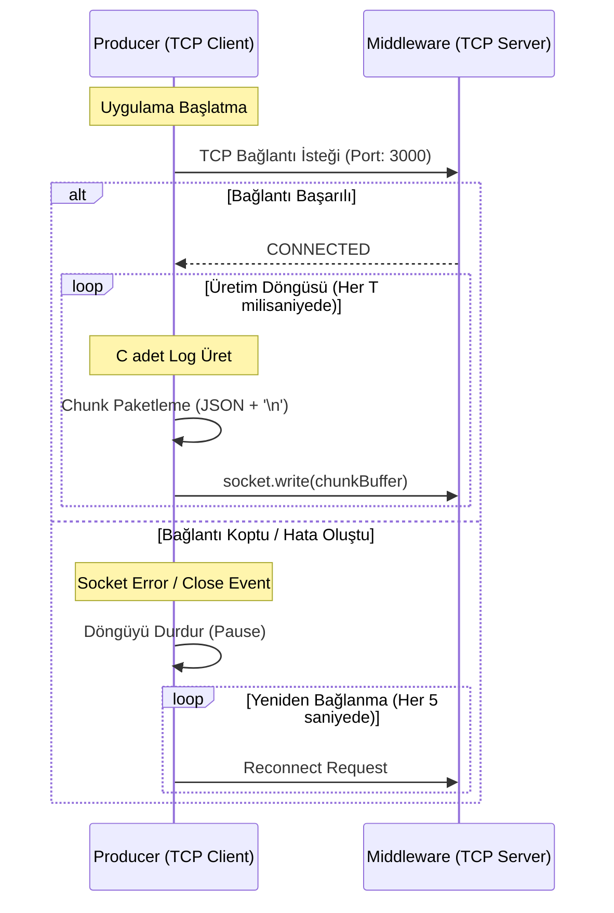

# 📊 Producer (Data Generator) Tasarım Belgesi

Bu doküman, CENG302 - Data Middleware projesinin **Producer (Veri Üretici)** modülünün tasarım ayrıntılarını, veri modelini, TCP chunk aktarım protokolünü ve backpressure (geri basınç) uyumlu yük testi yönetim planını açıklamaktadır.

---

## 📋 1. Giriş ve Amaç

**Producer** modülü, borsa altyapısındaki yüksek hacimli işlem günlüklerini (log) simüle eden bir Node.js / TypeScript uygulamasıdır. Amacı:
1. `faker.js` kullanarak borsa işlemlerini, kullanıcı girişlerini ve sistem hatalarını temsil eden gerçekçi, yüksek hacimli ham veriler üretmek.
2. Üretilen bu verileri tekil olarak değil, belirli boyutlarda (örn. 500-1000 kayıt) **JSON dizileri (chunks)** halinde paketlemek.
3. Ham paketleri, TCP soketi üzerinden satır bazlı veya delimitörlü bir protokolle **Middleware**'e iletmek.
4. Ağ veya Middleware yavaşladığında kendi belleğini doldurmamak (Memory Leak engellemek) amacıyla **Backpressure** mekanizmasını yönetmektir.

---

## 🗂️ 2. Ham Log Verisi JSON Şeması (IRawLogData)

Üretilecek ham log verileri, `shared/types.ts` içerisindeki `IRawLogData` arayüzüne tam uyumlu olmalıdır.

### 2.1. Alan Tanımları ve Tipleri

| Alan Adı | Veri Tipi | faker.js Metodu / Açıklama |
| :--- | :--- | :--- |
| `timestamp` | `string` | `faker.date.recent().toISOString()` (ISO 8601 formatında zaman damgası) |
| `level` | `LogLevel` | `LogLevel.INFO`, `WARNING`, `ERROR`, `CRITICAL` değerlerinden biri (Belirli ağırlıklara göre rastgele seçilir) |
| `fullName` | `string` | `faker.person.fullName()` (Müşterinin adı ve soyadı) |
| `tcNo` | `string` | Algoritmik olarak doğrulanabilir 11 haneli T.C. Kimlik Numarası |
| `creditCard` | `string` | `faker.finance.creditCardNumber('####-####-####-####')` (Kredi kartı numarası) |
| `email` | `string` | `faker.internet.email()` (Müşteri e-posta adresi) |
| `message` | `string` | Borsa işlemlerine özgü gerçekçi mesaj şablonları (örn: "Para yatırma işlemi gerçekleştirildi") |
| `details` | `string` | İşlemle ilgili JSON formatında ek detaylar (Hisse sembolü, miktar, IP, User Agent vb.) |

### 2.2. T.C. Kimlik Numarası Algoritması (TC Kimlik No Validasyonu Uyumlu)
Gerçekçi ve doğrulanabilir `tcNo` üretimi için şu kurallara uyulacaktır:
- 11 haneli olmalıdır.
- İlk hanesi `0` olamaz.
- 1, 3, 5, 7 ve 9. hanelerin toplamının 7 katından, 2, 4, 6 ve 8. hanelerin toplamı çıkartıldığında elde edilen sonucun 10'a bölümünden kalan (modulo 10), 10. haneyi vermelidir.
- 1, 2, 3, 4, 5, 6, 7, 8, 9 ve 10. hanelerin toplamının 10'a bölümünden kalan (modulo 10), 11. haneyi vermelidir.

### 2.3. Örnek JSON Log Verisi (`IRawLogData`)

```json
{
  "timestamp": "2026-05-23T18:25:00.123Z",
  "level": "CRITICAL",
  "fullName": "Ahmet Yılmaz",
  "tcNo": "10000000146",
  "creditCard": "4352-8765-1234-9081",
  "email": "ahmet.yilmaz@borsamail.com",
  "message": "Limit Order Execution Failed - Insufficient Margin",
  "details": "{\"symbol\":\"THYAO\",\"side\":\"BUY\",\"quantity\":500,\"price\":312.50,\"ip\":\"192.168.1.45\",\"userAgent\":\"Mozilla/5.0 (Windows NT 10.0; Win64; x64)\"}"
}
```

---

## 🔌 3. TCP Chunk Gönderim Algoritması ve Veri Akışı

TCP akışları (streams) ham byte'lar gönderdiği için, alıcı tarafın paketlerin sınırlarını (nerede başlayıp nerede bittiğini) doğru tespit etmesi gerekir. Bu duruma **TCP Packet Fragmentation & Merging** (Paket Bölünmesi ve Birleşmesi) denir.

### 3.1. Çerçeveleme (Framing) Protokolü: NDJSON

Bu projede veriler **Newline-Delimited JSON (NDJSON)** biçiminde gönderilecektir:
1. Producer, `N` adet `IRawLogData` logunu içeren bir JavaScript dizisi (chunk) oluşturur.
2. Bu dizi `JSON.stringify(chunk)` ile tek satırlık bir metne dönüştürülür.
3. Dönüştürülen string'in sonuna yeni satır karakteri `\n` eklenir.
4. Elde edilen buffer TCP soketine yazılır: `socket.write(JSON.stringify(chunk) + '\n')`.
5. Middleware tarafındaki `TCPChunkAdapter`, gelen buffer verilerini biriktirir ve her `\n` karakterini gördüğünde bir chunk'ın tamamlandığını anlayarak ayrıştırır.

```
+-------------------------------------------------------------+
|  [Log 1, Log 2, ..., Log N] (JSON Array String)             | --> Chunk 1
+-------------------------------------------------------------+
|  \n (Delimiter)                                             |
+-------------------------------------------------------------+
|  [Log 1, Log 2, ..., Log N] (JSON Array String)             | --> Chunk 2
+-------------------------------------------------------------+
|  \n (Delimiter)                                             |
+-------------------------------------------------------------+
```

### 3.2. Bağlantı ve İletişim Akışı



---

## ⚡ 4. Backpressure Uyumlu Yük Testi ve Döngü Yönetimi

Yüksek performanslı yük testlerinde, Producer'ın veri üretim hızı Middleware'in veri işleme hızından daha fazla olabilir. Bu durumda TCP soketinin tampon belleği (buffer) dolar ve işletim sistemi seviyesinde tıkanıklık oluşur. Node.js üzerinde bu durum yönetilmezse bellek aşımı (`OutOfMemory`) hatası alınabilir.

### 4.1. Geri Basınç (Backpressure) Mekanizması Çalışma Prensibi

1. **`socket.write()` Kontrolü:** Node.js `net.Socket` nesnesinin `write` fonksiyonu bir boolean değer döner:
   - `true`: Veri ağ tamponuna başarıyla yazıldı.
   - `false`: Ağ tamponu dolu. Veri sistem belleğinde (kernel space / user space buffer) kuyruğa alındı. Bu, **üretimin durdurulması** gerektiğinin işaretidir.
2. **Döngüyü Durdurma (Pause):** `socket.write()` ifadesi `false` döndüğü anda Producer log üretim döngüsünü durdurur (`isPaused = true`).
3. **Tahliye Olayı (Drain Event):** TCP soketi tamponundaki verileri ağa başarıyla gönderip temizlediğinde `'drain'` olayını (event) tetikler.
4. **Döngüyü Devam Ettirme (Resume):** Producer, `'drain'` olayını dinler. Olay tetiklendiğinde `isPaused = false` yapar ve log üretim döngüsünü kaldığı yerden devam ettirir.

### 4.2. Döngü Yönetim Algoritması (Pseudocode)

Aşağıdaki algoritma, hem yapılandırılabilir hızları (`chunkSize` ve `intervalMs`) destekler hem de dinamik backpressure durumlarına göre kendini durdurup başlatır.

```typescript
class LogProducer {
  private socket: net.Socket;
  private isPaused: boolean = false;
  private intervalId: NodeJS.Timeout | null = null;
  
  // Yapılandırma Parametreleri
  private chunkSize: number = 500;
  private intervalMs: number = 100;

  constructor(socket: net.Socket, chunkSize: number, intervalMs: number) {
    this.socket = socket;
    this.chunkSize = chunkSize;
    this.intervalMs = intervalMs;
    
    // Soket drain olayını dinle
    this.socket.on('drain', () => {
      console.log('TCP Buffer temizlendi. Log üretimi devam ediyor...');
      this.isPaused = false;
      this.resumeLoop();
    });
  }

  public start(): void {
    console.log(`Log üretimi başlatıldı. Chunk: ${this.chunkSize}, Interval: ${this.intervalMs}ms`);
    this.resumeLoop();
  }

  private resumeLoop(): void {
    if (this.intervalId) return;

    const run = () => {
      if (this.isPaused) {
        // Eğer durdurulmuşsa, yeni bir döngü planlama, drain olayını bekle
        this.intervalId = null;
        return;
      }

      // 1. Chunk boyutunda log üret
      const logs: IRawLogData[] = [];
      for (let i = 0; i < this.chunkSize; i++) {
        logs.push(generateRawLog()); // faker.js tabanlı log üretici
      }

      // 2. NDJSON formatında serialize et
      const payload = JSON.stringify(logs) + '\n';

      // 3. TCP üzerinden gönder ve buffer durumunu kontrol et
      const canWrite = this.socket.write(payload, 'utf8');

      if (!canWrite) {
        console.warn('TCP Buffer doldu! Log üretimi askıya alınıyor (Backpressure).');
        this.isPaused = true;
        this.intervalId = null;
      } else {
        // Bir sonraki adımı planla
        this.intervalId = setTimeout(run, this.intervalMs);
      }
    };

    run();
  }

  public stop(): void {
    if (this.intervalId) {
      clearTimeout(this.intervalId);
      this.intervalId = null;
    }
  }
}
```

---

## 📈 5. Yük Testi Yapılandırma Senaryoları

Middleware modülünün stres limitlerini ölçmek amacıyla Producer aşağıdaki senaryolarda çalıştırılabilecektir:

1. **Normal Yük (Standart Akış):**
   - Chunk Boyutu: `200` log
   - Aralık: `500ms`
   - Saniyede Üretim: `400` log/sn
2. **Yoğun Yük (Yüksek Akış):**
   - Chunk Boyutu: `500` log
   - Aralık: `100ms`
   - Saniyede Üretim: `5000` log/sn
3. **Stres Testi (Maksimum Akış - Sıfır Gecikme):**
   - Chunk Boyutu: `1000` log
   - Gecikme: `0ms` (Recursive `setImmediate` veya `process.nextTick` kullanarak)
   - Saniyede Üretim: Ağ bant genişliği ve CPU sınırına bağlı olarak maksimum verimlilik. Bu modda backpressure mekanizması neredeyse sürekli devreye girerek akışı dengeleyecektir.
